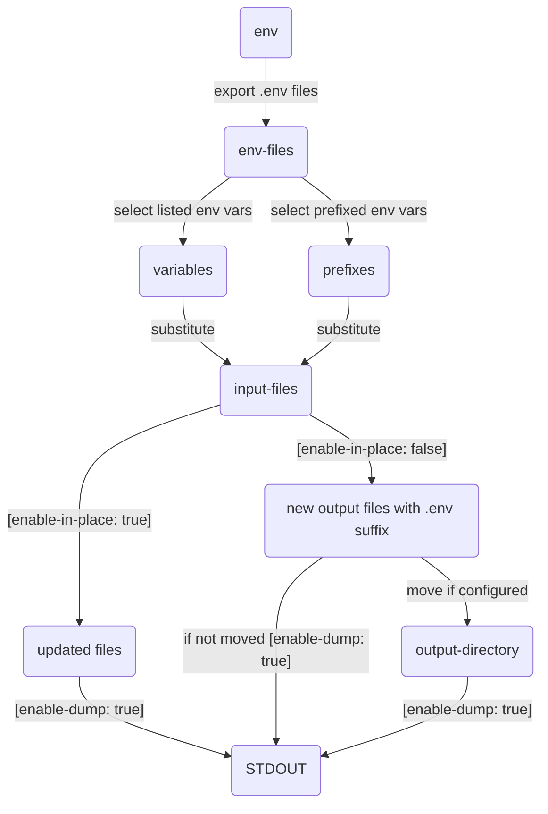

# envsubst-action

[](https://github.com/iamAzeem/envsubst-action/actions/workflows/ci.yml)
[](https://github.com/iamAzeem/envsubst-action/blob/master/LICENSE)

[](https://www.buymeacoffee.com/iamazeem)

[GitHub Action](https://docs.github.com/en/actions) to substitute environment
variables in files.

The variables may be specified as `$VARIABLE` or `${VARIABLE}` in files.

Tested on Linux, macOS, and Windows runners.
See [CI workflow](.github/workflows/ci.yml) for more details.

## Flow Diagram



## Usage

### Inputs

|       Input        | Required | Default | Description                                                    |
| :----------------: | :------: | :-----: | :------------------------------------------------------------- |
|    `env-files`     | `false`  |         | List of `.env` files containing `VARIABLE=VALUE` per line      |
|   `input-files`    |  `true`  |         | List of input files to substitute environment variables        |
|    `variables`     | `false`  |         | List of variables to substitute; the rest is ignored           |
|     `prefixes`     | `false`  |         | List of prefixes to select env vars in addition to `variables` |
| `output-directory` | `false`  |         | Output directory path when `enable-in-place: false`            |
| `enable-in-place`  | `false`  | `true`  | Enable/disable in-place substitution                           |
|   `enable-dump`    | `false`  | `false` | Enable/disable dumping of updated/generated files              |

## Examples

### Substitute env vars using `env`

```yml
- uses: iamazeem/envsubst-action@v1
  env:
    ENV_VAR1: 'env_val1'
    ENV_VAR2: 'env_val2'
  with:
    input-files: |
      input.json
      input.yaml
```

### Substitute env vars using `env` and `env-files`

```yml
- uses: iamazeem/envsubst-action@v1
  env:
    ENV_VAR1: 'env_val1'
    ENV_VAR2: 'env_val2'
  with:
    env-files: |
      env-file1.env
      env-file2.env
    input-files: |
      input.json
      input.yaml
```

### Substitute env vars using `variables`

```yml
- uses: iamazeem/envsubst-action@v1
  env:
    ENV_VAR1: 'env_val1'
    ENV_VAR2: 'env_val2'
    ENV_VAR3: 'env_val3'            # Ignored
  with:
    variables: |
      ENV_VAR1
      ENV_VAR2
    input-files: |
      input.json
      input.yaml
```

### Substitute env vars using `prefixes`

```yml
- uses: iamazeem/envsubst-action@v1
  env:
    ENV_VAR: 'env_var'
    TEST_VAR: 'test_var'            # Ignored
    SAMPLE_VAR: 'sample_var'        # Ignored
  with:
    prefixes: |
      ENV_VAR
    input-files: |
      input.json
      input.yaml
```

### Substitute env vars using `variables` and `prefixes`

```yml
- uses: iamazeem/envsubst-action@v1
  env:
    ENV_VAR1: 'env_val1'
    ENV_VAR2: 'env_val2'            # Ignored
    ENV_VAR3: 'env_val3'            # Ignored
    TEST_VAR1: 'test_var1'
    TEST_VAR2: 'test_var2'
  with:
    variables: |
      ENV_VAR1
    prefixes: |
      TEST_VAR
    input-files: |
      input.json
      input.yaml
```

## Contribute

You may [create
issues](https://github.com/iamazeem/envsubst-action/issues/new/choose) to report
bugs or propose new features and enhancements.

PRs are always welcome. Please follow this workflow for submitting PRs:

- [Fork](https://github.com/iamazeem/envsubst-action/fork) the repo.
- Check out the latest `main` branch.
- Create a `feature` or `bugfix` branch from `main`.
- Commit and push changes to your forked repo.
- Make sure to add tests. See [CI](./.github/workflows/ci.yml).
- Lint and fix
  [Bash](https://www.gnu.org/savannah-checkouts/gnu/bash/manual/bash.html)
  issues with [shellcheck](https://www.shellcheck.net/) online or with
  [vscode-shellcheck](https://github.com/vscode-shellcheck/vscode-shellcheck)
  extension.
- Lint and fix README Markdown issues with
  [vscode-markdownlint](https://github.com/DavidAnson/vscode-markdownlint)
  extension.
- [mermaid.js](https://mermaid.js.org/) has been used to create the flow
  diagram. See its [flowchart](https://mermaid.js.org/syntax/flowchart.html)
  syntax to update the flow diagram if required.
- Submit the PR.

## License

[MIT](LICENSE)
